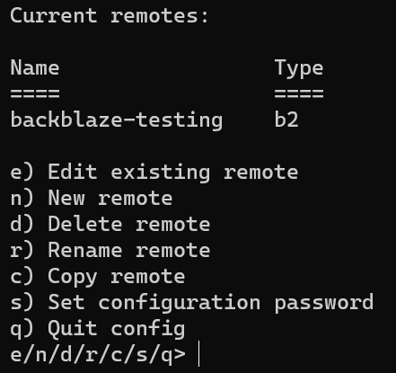
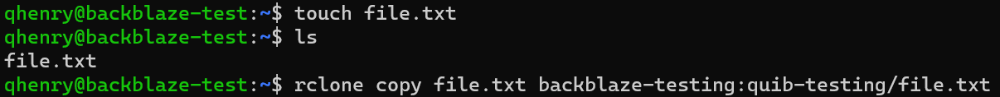

I recently set off to find a cheap (and hopefully free) cloud backup solution for some crucial files in my home infrastructure. I stumbled upon Backblaze's B2 object storage solution (similar to Amazon S3 or Azure Blob). Backblaze is pretty awesome, and provides up to 10GB free storage across multiple buckets to try it out!

&nbsp;

## Requirements

 - A Linux machine (virtual, container, or bare metal)
 - Super sudoer powers
 - A Backblaze account


&nbsp;

------
&nbsp;

## 🐧 Prepare Linux

### ⬆️ Make sure you have the latest updates

```bash
sudo apt update
sudo apt upgrade
```

### ✨ Install `curl` (if not already)

```bash
sudo apt install curl
```

### ✨ Install `Rclone`

Rclone is a tool written in Go that allows the movement of files between local and remote directories. It can be installed by following the tutorial on [their docs](https://rclone.org/install/).

To check if `Rclone` is installed properly, just type `rclone` in your CLI. As long as you don't get the "Unrecognized command" error, you're good!


&nbsp;


## 🔥 Prepare Backblaze

Make sure you have a Backblaze account created, and log in.

### 🪣 Create a Bucket

 - Make sure you are in your buckets list
 - Create a bucket
   - Give it a unique name
   - Private
   - Encryption disabled
   - Object lock disabled
   - Click create

### 🔑 Create App key

 - Click `App keys` on the left
 - Scroll down, click `Add a New Application Key`
   - Give it a friendly name
   - If you want to restrict the key to a specific bucket, choose it from the dropdown
   - Keep it set to read/write
   - Click create
 - Make sure to save the `keyID` and `applicationKey` for later


&nbsp;


## 🎚️ Set up Rclone

In Linux, enter the command `rclone config`
 - Type `n` for a new remote
 - Give it a name (such as backblaze-bucketname)
 - This will list a bunch of supported remotes, find `Backblaze B2` in the list, and enter the corresponding number into the prompt
 - For `Account`, use the `keyID` received from generating the App key
 - For `Key`, use the `applicationKey1 received from generating the App key

 - Set the following values as you see fit. The defaults should be good for most cases.

 - Once the list of current remotes shows, you can quit the config CLI with `q`


 - Remotes can be checked by using `rclone listremotes`
   - This will return a list of all of your remotes


&nbsp;


## 📃 Copy a file (or directory) to your B2 bucket

The proper syntax to copy a file is

```bash
rclone copy [directoryOrFileName] [nameOfRemote]:[bucket]/[directoryOrFileToCopyTo]
```


 - `cd` into a directory that contains the file you want to copy up. Let's say this file is named `file.txt`
 - Use `rclone copy` to copy up the file
   - Keep in mind, my remote's name is `backblaze-testing` and my bucket's name is `quib-testing`

```bash
rclone copy file.txt backblaze-testing:quib-testing/file.txt
```



 - For a directory, this is very similar. Let's say this directory is named `directory/`

 ```bash
 rclone copy directory backblaze-testing:quib-testing/directory
 ```

If this was successful, nothing is returned.


&nbsp;


## ✅ Check if your file is uploaded

Back in Backblaze, click `Browse Files`, and select the bucket you would like to browse.

If the file uploaded properly, it should show up there!