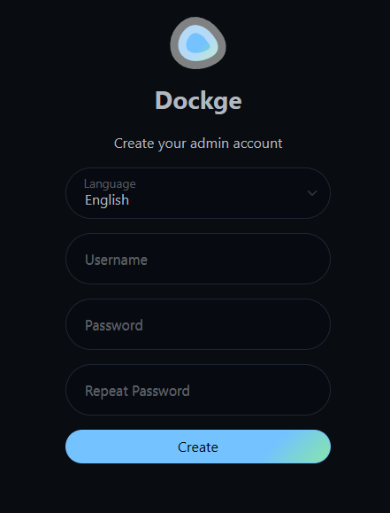
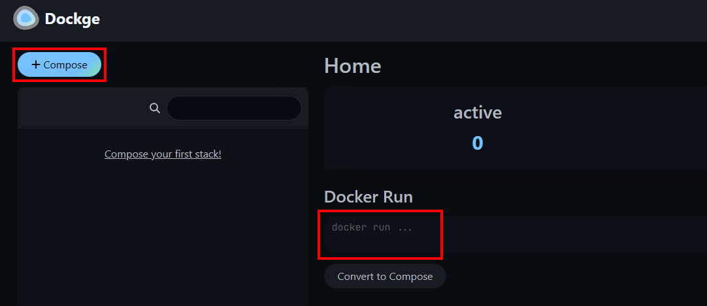
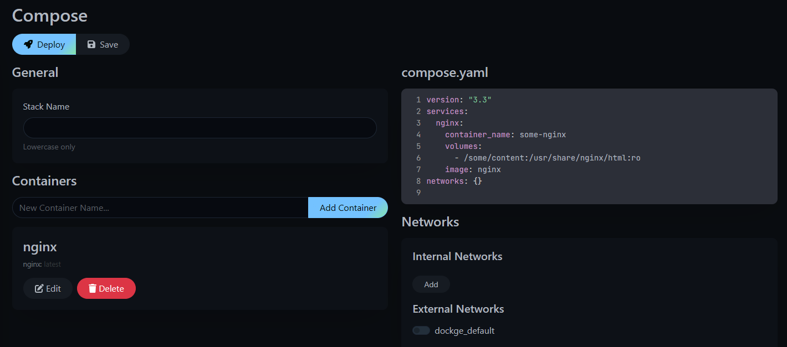
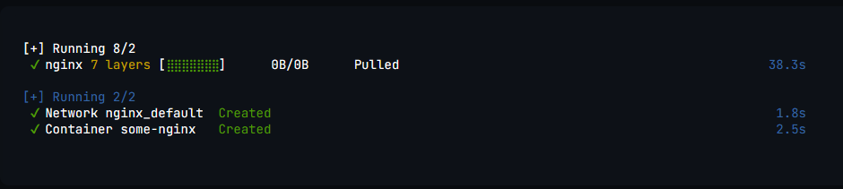
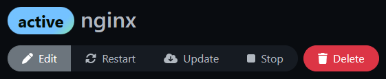

A static website is a plain and simple site with some HTML and CSS, without the need for a database or a beefy server.

Hugo is one of many different static site generators. The most popular is called [Jekyll](https://jekyllrb.com/), and is a bit simpler to use than Hugo. It's mostly personal preference, but here we'll be going through setup for Hugo.

&nbsp;

## Requirements

 - A Linux computer or virtual machine with Docker and the Compose plugin installed
   - You can install Docker using their [official documentation](https://docs.docker.com/engine/install/)

## Optionals
 - Traefik reverse proxy to easily secure with TLS

&nbsp;

------

&nbsp;

## 📁 Create directories

Firstly, you'll have to create two directories. One of these will store the *Dockge* compose file (`/opt/dockge`), the other will store all of your other stacks (`/opt/stacks`).

 - Log into your server
 - Run the following to creat the directories:
```bash
sudo mkdir /opt/dockge
sudo mkdir /opt/stacks
```

------

&nbsp;

## 🐋 Create and spin up *Dockge* container

### 📋 Create project

 - With the directories created, `cd` into the `/opt/dockge` directory and create the `compose.yml` file
```bash
cd /opt/dockge
sudo touch compose.yml
```

 - Edit the file
```bash
sudo nano compose.yml
```

 - Add the following contents to the file (the defaults should be fine for getting started quick):
   - This example can also be found on this projects [repository](https://github.com/louislam/dockge)
   - You may notice the tag is `1`, this seems to be the tag used for the latest version, you can also get a specific version from the [releases](https://github.com/louislam/dockge/releases/tag/1.0.3) page of the repository
```yaml
version: "3.8"

services:
  dockge:
    image: louislam/dockge:1
    container_name: dockge
    restart: unless-stopped
    ports:
      - 5001:5001
    volumes:
      - /var/run/docker.sock:/var/run/docker.sock
      - ./data:/app/data
      - /opt/stacks:/opt/stacks
    environment:
      - DOCKGE_STACKS_DIR=/opt/stacks
```

### ✨ Spin up *Dockge*

 - With the `compose` file created, spin it up with `docker compose`
```bash
docker compose up -d
```

 - This will pull the latest version of *Dockge* and run it

------

&nbsp;

## ✨ Connect and perform first time setup

 - Get the IP address of your machine using the command `ip address`
   - This is typically found in `eth0`
 - Open a web browser and navigate to *http://your.ip.address.here:5001*
   - Ex. `http://192.168.1.10:5001`
 - You should be presented with a page to create your admin account:



 - Fill in the details as you see fit, and click `Create`
 - This should take you to the Dockge home page

------

&nbsp;

## ✅ Using Dockge

### 📃 Home page
The home page shows you current managed and non-managed stacks. Managed stacks are in the directory created earlier, `/opt/stacks`.

 - You can create a stack by clicking the `+ Compose` button, or by entering a *docker run* command to convert it to a compose file



### 📃 Compose page
Clicking the `+ Compose` button or converting a docker run command will take you to the *Compose* page.

Let's say you want to spin up nginx with the command:
```bash
docker run --name some-nginx -v /some/content:/usr/share/nginx/html:ro -d nginx
```

Entering this to be converted to *Compose* will result with the following page:

\

You can managed more container settings by clicking the `Edit` button under `Containers`.


#### ⬆️ Starting a container
Once you're satisfied with the container, click `Deploy` and watch the magic happen!

Dockge will do the rest of the work, and provide a realtime terminal output of the progress, and present with the result:



#### 🕹️ Container controls
Once the container is running, it will show with an `active` badge next to it, and present you with a few options to manage it. All of which are pretty self-explanatory:



------

&nbsp;

## ✈️ Using with *Traefik*
To proxy Dockge through traefik, there are two options: If Dockge is running on the same local server as the Traefik container, or on a remote server. This will go over the labels for running on the same server as *Traefik*.

### ✅ On same server as *Traefik* container
 - Edit your *Dockge* `compose.yml` file:
```bash
sudo nano /opt/dockge/compose.yml
```

 - Add the following labels as such:
```yaml
    # Traefik labels
    labels:
      - "traefik.enable=true"
      - "traefik.http.routers.dockge.entrypoints=http"
      - "traefik.http.routers.dockge.rule=Host(`dockge.example.com`)" # Replace with your subdomain
      - "traefik.http.middlewares.dockge-https-redirect.redirectscheme.scheme=https"
      - "traefik.http.routers.dockge.middlewares=dockge-https-redirect"
      - "traefik.http.routers.dockge-secure.entrypoints=https"
      - "traefik.http.routers.dockge-secure.rule=Host(`dockge.example.com`)" # Replace with your subdomain
      - "traefik.http.routers.dockge-secure.tls=true"
      - "traefik.http.routers.dockge-secure.service=dockge"
      - "traefik.http.services.dockge.loadbalancer.server.port=5001" # This should match the container port (to the right of the ":")
      - "traefik.docker.network=proxy"

    # Make sure to include your Traefik network, mine is named "proxy", this should match the value of traefik.docker.network
    networks:
      proxy:
        external: true
```

 - After updating, recreate the container:
```bash
docker compose up -d --force-recreate
```

As long as your *Traefik* instance is working, and all labels match your instance settings (you may need to change some things based on how you have *Traefik* set up), you should be able to navigate to your subdomain name!


## ⬆️ Updating Dockge
To update Dockge, run the following commands:
```bash
cd /opt/dockge
docker pull louislam/dockge:1
docker compose up -d
```

These command will:
 - Change your directory to the where the *Dockge* `compose.yml` file is
 - Pull the latest version of *Dockge* (`louislam/dockge:1`)
 - Recreate the container with the latest pulled image