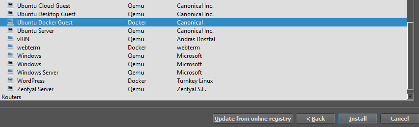
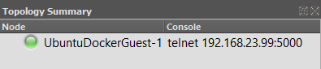

When diving into learning networking, GNS3 is a great tool to get started. GNS3 allows you to build out and design networks without having to buy all of the expensive hardware to do so.

&nbsp;

------

&nbsp;

## Requirements

- A GNS3 VM server, or server running on your local machine
  - Check out [GNS3 in Proxmox VE](/gns3-vm-in-proxmox-ve)
- GNS3 client on your local computer
  - Download the GNS3 Client from the [official website](https://www.gns3.com/software/download)

## Optional
- [Cisco Modeling Labs IOSv router/switch images](https://learningnetworkstore.cisco.com/cisco-modeling-labs-personal/cisco-cml-personal)

&nbsp;

------

&nbsp;

## Loading GNS3

Start by opening your GNS3 client. Here, a dialog shows to create a new project.
 - If you are running the GNS3 server on your local machine, go ahead and create a new project, name it whatever you want
 - If you are running the GNS3 server on a remote machine
   - Go to Edit > Preferences > Server
   - Change 'Host' to the IP address of your server
   - Change the port to '80 TCP' (Or the port you have it set to if you've changed it)
   - Fill out the 'user' and 'password' fields (Default user is 'gns3' and password is 'password')
   - Click 'Apply' and close the preferences window
   - Go to File > New blank project, name the new project whatever you want

&nbsp;

------

&nbsp;

## Installing an appliance

On the left hand side of the window, you will find a toolbar with the following icons:

From top to bottom, these items are *Routers*, *Switches*, *End Devices*, *Security Devices*, *All Devices*, and *Add a link*. These buttons contain what are called templates, templates are virtual devices that can be manipulated just as if they were the real deal.

All of these are relatively self explanatory, the last *"Add a link"* is for connecting devices together using a virtual network cable.

To get started and testing things, go to *End Devices* and click "+ New template". You will want to install an appliance from the server, so click "Next >", expand "Guests", and scroll to find an appliance that interests you. I'll be choosing the "Ubuntu Docker Guest" as docker containers start up in just a few seconds.

Once you have found the device you want, click "Install", then "Next" to install on the main server, then "Finish". Now, the appliance should be installed!

&nbsp;

------

&nbsp;

## Adding devices to a project

Now, the newly installed appliance should show up under *End Devices*. Click this, and drag the device into the blank space of the project. This will do some downloading work if you have just installed it, then add itself into the project.

To use the device, you can either click the green play button at the top of the window (this would start all devices in the project), or you can right click an individual device, and click "Start".

You can confirm that the device has started by looking at the "Topology Summary" on the top right of the window. A green circle indicates that a device is online.

To get console access to this docker guest, you can double click on the node, or right click and hit "console". This, by default, will open the Solarwinds Solar-PuTTY application on your computer. You can interact with the device just as if it were a physical one.

&nbsp;

------

&nbsp;

## Final thoughts

Keep in mind, each devices has its own configuration settings that you can mess with, as well as console types depending on if the device has a GUI or not (Such as between the Ubuntu Docker and Ubuntu Desktop guests). Some of these settings include amount of CPU cores, RAM, and type of console access you have to the device.

Feel free to play around with these and figure some stuff out! The beauty of GNS3 is that you can do anything you want, and not have to worry about breaking anything of importance :)

&nbsp;

------

&nbsp;

### Conclusion

And there you have it! Go ahead and play with the different end devices, as well as switching/routing appliances that exist. If you have the Cisco Modeling labs subscription, you are also able to import the IOSv images into GNS3, which will allow you to interact and play with Cisco IOS devices.