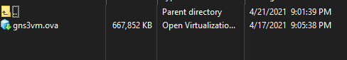
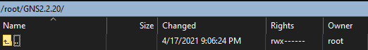
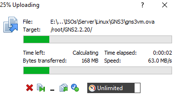
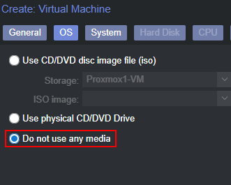
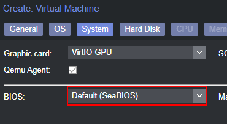
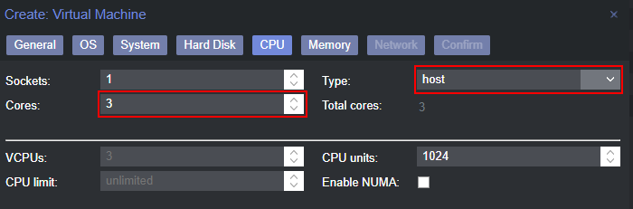
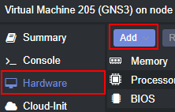
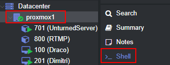

Do you use Proxmox VE as your main homelab hypervisor, and want to run the GNS3 VM on it? You're in luck, below you can find steps on how to do just that as long as you meet a few server requirements.

<br>

# Requirements

- Proxmox VE with 3-4
- A VM storage device that supports .qcow2 files
- Location of VM disks on your Proxmox Server
- FTP and Shell access to your Proxmox Server

<br>

------

<br>

# Download the .ova file

Head over to the GNS3 website and download the ESXi VM [https://gns3.com/software/download-vm](https://gns3.com/software/download-vm)

Keep in mind, this will ask you to create an account before you can download.

<br>

------

<br>

# Upload the .ova file to your server

Now you will need to get the downloaded file onto your Proxmox server

 - Open your favorite FTP client on your computer. In my case, I'm using WinSCP to do this
 - Connect to your Proxmox server using either its IP address or hostname
 - On the left pane (your local machine), navigate to where the `.ova` file is



<br>

 - On the right pane (the server), create a new directory, naming whatever you want
 - I'll be putting mine underthe `/root` directory



<br>

 - Now, drag the `.ova` file from the left side to the right side, and you will see the upload begin



<br>

------

<br>

# Create a VM in Proxmox

Now we're going to want to create a VM in Proxmox that we will be adding hard disk to

 - Create a VM by clicking "Create VM" on the top right
 - Under "General", you can use any ID starting from 100 that you like, take note of this. Name it whatever you would like
 - Under "OS", select the radio button to not use any media



 - Under "System", select your preferred graphics card (I will be using the VirtIO option), and make sure "SeaBIOS" is selected



 - Under "Storage", make sure SCSI is selected, and a qcow2 compatible storage device is selected
 - Under CPU, give it at least 3 cores to run with, and make sure to select 'host' for the type



 - Under "Memory", give it at least 4096MB of RAM
 - Set your preferred settings under "Network", the default model will work just fine and should have the best performance

 <br>

 ------

 <br>

 # Create secondary hard disk

 - Navigate to the newly created VM
 - Go to the "Hardware" tab



 - Select the same storage device that you chose when creating the VM
 - Change the size to whatever you would like to make it
 - Click the 'Add' button at the bottom
 - You should now have 2 hard disks in the machine, 'scsi0' and 'scsi1'

<br>

------

<br>

# Extract files from the .ova file

We will need to grab files that are packaged into the file downloaded from the GNS3 website. .ova files typically contain 2 main parts: VM Configuration settings (we just did this), and virtual hard disks (In the .vmdk format)

 - First access the shell of the Proxmox server, this can be either over SSH, or using the shell tab in Proxmox



 - Change your current directory to where you stored the .ova file earlier using the 'cd' command. In my case, that would be:

```bash
cd /root/GNS2.2.20
```

 - Now, to extract the files using tar to the current directory, and list the new files

```bash
tar -xvf *.ova
ls
```

 - This will show the new files in the current directory, these should be:
   - `GNS3 VM-disk001.vmdk`
   - `GNS3 VM-disk002.vmdk`
   - `GNS3 VM.ovf`

The 2 `.vmdk` files are the virtual hard disks, and the `.ovf` file is the VM configuration file

<br>

------

<br>

# Convert .vmdk files to .qcow2 qemu files

In order for Proxmox to properly use the hard disks we just snatched, we need to convert them to .qcow2 (qemu) hard disks

 - Get that VM ID you set earlier when creating the VM, I used 501 in my case
 - Convert each file, replacing vmid with your VM ID:

```bash
qemu-img convert -f vmdk 'GNS3 VM-disk001.vmdk' -O qcow2 vm-vmid-disk-0.qcow2 
qemu-img convert -f vmdk 'GNS3 VM-disk002.vmdk' -O qcow2 vm-vmid-disk-1.qcow2 
```

Here's an example of what mine looked like:

```bash
qemu-img convert -f vmdk 'GNS3 VM-disk001.vmdk' -O qcow2 vm-501-disk-0.qcow2 
qemu-img convert -f vmdk 'GNS3 VM-disk002.vmdk' -O qcow2 vm-501-disk-1.qcow2 
```

<br>

------

<br>

# Copy the newly converted .qcow2 files

Now we can copy the files to the VM folder!

 - Make sure you're still in the same directory as the .qcow2 files
 - Find the directory of the VM you will be copying the files to
   - In my case, my GNS3 VM is located at /mnt/pve/Proxmox-1-VM/images/501
   - 501 in this directory is my VM ID
 - Use  the `cp` command to copy the files to the vm directory

```bash
cp vm-vmid-disk-0.qcow2 /directory/of/vm/vm-vmid/
cp vm-vmid-disk-1.qcow2 /directory/of/vm/vm-vmid/
```

Here's an example of what mine looked like:

```bash
cp vm-501-disk-0.qcow2 /mnt/pve/Proxmox1-VM-images-501/ 
cp vm-501-disk-1.qcow2 /mnt/pve/Proxmox1-VM-images-501/
```

<br>

------

<br>

# Start the VM

Now you should be good to go! Try and start the VM, and head to the console tab. GNS3 should start to load, and you can begin creating your virtual networks!

<br>

------

<br>

# Optional - Install qemu-guest-agent on GNS3

I know that when I have a VM in Proxmox, I like to get some quick information sometimes straight from the GUI... such as the VM's IP address. This is only possible if the qemu guest agent installed on the machine.

Lucky for us, the GNS3 VM runs on Ubuntu, so this is pretty easy!

 - Once GNS3 is loaded, go to the console tab, and press enter in the window to hit OK
 - Arrow-down to the option "Shell" and hit enter
 - In the shell, type the following commands:

```bash
sudo apt update
sudo apt install qemu-guest-agent
sudo systemctl start qemu-guest-agent
```

 - This will update the repository, install the guest agent, and start the guest agent service
 - Now, click the "Summary" tab of the VM in Proxmox,  more information (such as the VM's IP address) will now show right there!

*Note: If the guest agent information doesn't show, try reloading the web page*