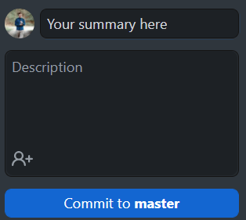
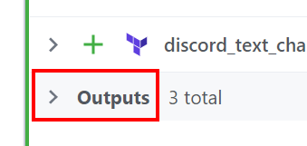

Yeah, Terraform is cool and all. But that's typically done locally. The cloud is even better, and free.

&nbsp;

## Why would I do this?

There are tons of reasons you may want to deploy with Terraform in the cloud. A few of my personal favorite highlights are...
 - Less load put on local hardware
 - It's still as simple as running locally
 - It can be easily automated, especially if `git` is used
   - Runs can occur on a push
 - It's **free**

&nbsp;

## Requirements

 - Knowledge with getting Terraform working locally
 - An existing and *working* Terraform project
 - **FREE** Terraform Cloud Account
   - [Get this here](https://app.terraform.io/signup/account)

------

## Deployment Methods

As of May 2022, there are 3 methods to deploy code with Terraform Cloud:
  1. [Version control workflow](#-method-1-version-control-workflow)
    - Store your Terraform configuration in a git repository, and trigger runs based on pull requests and merges
  1. [CLI-driven workflow](#-method-2-cli-driven-workflow)
    - Trigger remote Terraform runs from your local command line
  1. API-driven workflow
    - A more advanced option. Integrate Terraform into a larger pipeline using the Terraform API

For the purposes of this post, we will only be going over the first two: Version control and CLI-driven workflows.

The reason? They are the most common, especially if you're just getting started with Terraform. Most don't have a need to run API-driven workflows.

&nbsp;

------

&nbsp;

## 📕 **Method 1: Version control workflow**

In this post, I will be using GitHub to keep my repositories. Any git provider will work, as long as it is internet-accesible. If you are new to git, this is typically a good place to start.

This method is best used if you want to automate your workflows, as this can be done via updates to the repository.

&nbsp;

### Extra requirements

 - [GitHub Desktop](https://desktop.github.com/) is a super useful tool for pushing changes to a GitHub repo without the command line.
 - If you don't want to use this, and know how to use gitbash, that is perfectly fine too!

***NOTE***: If you structure your Terraform projects as I do, your repository created [below](#clone-repository-locally), you will need to update your `.gitignore` file to include `*.auto.tfvars` so that your credentials are not stored for just anyone to see (such as API tokens)

&nbsp;

### Create a Git repository

Login into [GitHub](https://github.com)
 - Create a new repository with the "New" button 
 - Make sure this is set as `Public` to make things a bit easier
   - Setting this as private would require setting up SSH keys for Terraform Cloud to read the repo
 - Give this repository a name, and initialize it with a `README` file and choose the `Terraform` `.gitignore` template.

&nbsp;

### Clone repository locally

In GitHub desktop, login to your account, and add a new repository by searching for the one you just created.
 - You'll have to choose a location to store this, it would be best to keep this somewhere simple (such as a shorter path)

You can also clone the repository via the command line with:
```bash
cd /path/to/directory
git clone https://github.com/YourUserName/YourRepositoryName
```

&nbsp;

### Set up Terraform Cloud

Head over to the [Terraform Cloud web interface](https://app.terraform.io), and log in.
 1. Create a new `Organization`, if needed.
 1. Create a new `Workspace` within the organization
 1. Here you are presented with 3 options, make sure to select `Version Control Workflow`
 1. Get connected to your git provider
 1. This will open a new window, asking you to sign into your provider
 1. In the list that shows, select the repository you will be using
 1. By default, the workspace name will auto-populate with the repo name, probably best to keep this for readability's sake
 1. Click `Create Workspace`

&nbsp;

### Add variables to your workspace

The best and safest way to store variables for Terraform is to actually use Terraform Cloud. To create variables to use for your project, click on the `Variables` tab, and create each variable you have in your local project.

Now Terraform Cloud is ready!

&nbsp;

### Add Terraform configurations to repo

Now, find your working terraform project, and copy *ALL* of the files from there into your local repository location.

Once they are copied in, bring GitHub Desktop back up, enter a "Commit Summary" on the bottom-left: &nbsp;



And then at the top, push your changes to GitHub:


&nbsp;

### Stage changes in Terraform Cloud

Back in Terraform Cloud, click the `Overview` tab, and then `Start new plan`
 - This is the equivalent to running `terraform plan` in the local CLI

Once the plan is complete, it will show you the changes it will make!

&nbsp;

### Run plan!

To run the latest plan, scroll to the bottom of the page and click `Confirm and Apply`.
 - This is the equivalent to running `terraform plan -auto-approve` in the local CLI

***Now... Watch the magic happen.***

If your plan had `Outputs`, you can see those values by droping down the "Outputs" section:



&nbsp;

### Destroy infrastructure

To destroy the newly-created infrastructure, scroll back up to the top of the page, click `Settings` > `Destruction and Deletion`

 - Click `Queue destroy plan`
 - Enter your workspace name to confirm
 - Click `Queue destroy plan`
 - Once the plan finishes, click `Confirm and apply`

 - This is the equivalent to running `terraform destroy -auto-approve`

&nbsp;

------

&nbsp;

## ⌨️ **Method 2: CLI-driven workflow**

This method uses the local command-line to trigger workflows in Terraform Cloud. A command that is run locally will actually perform in the cloud, showing a "remote window" of the remote CLI locally. You'll see what I mean shortly...

&nbsp;

### Get Ready

As always for Terraform, `cd` into your project directory.

&nbsp;

### Get authenticated

So first, once you have your [Terraform Cloud](https://app.terraform.io) account, we'll need to log into to the terraform CLI.

To do this, run:
```bash
terraform login
```

This will prompt you to type `yes` and automatically open a web browser to the page to create an access token.
 - On this page, give the token a name, and hit create
 - Then copy the token and paste it into your terminal session
   - *Note*: This is the only time the token will show
 - Then you're logged in!

&nbsp;

### Set up Terraform Cloud

Head over to the [Terraform Cloud web interface](https://app.terraform.io), and log in.
 1. Create a new `Organization`, if needed.
 1. Create a new `Workspace` within the organization
 1. Here you are presented with 3 options, make sure to select `CLI-driven workflow`
 1. Name your workspace `Terraform-CLI-Test`
 1. Click `Create Workspace`
 1. Take note of the `Example code` for CLI-driven runs

&nbsp;

### Create Terraform Cloud file

Now, we need a way to tell our local Terraform installation run the configurations in the cloud.

To do this, create a file called `TerraformCloud.tf`, and add the example code from [earlier](#set-up-terraform-cloud-1):

```tf
terraform {
  cloud {
    organization = "YourOrganization"

    workspaces {
      name = "Terraform-CLI-Test"
    }
  }
}
```

*Note*: If using the above example, make sure to change the organization name to your own

&nbsp;

### Test 'er out

Now, this should be pretty much it. Assuming your project works correctly, you can now run all of the regular Terraform CLI commands locally, and they will execute in the cloud.

To test this out, try running `terraform plan` and check the web interface to see the plan in action.

Once that is all good to go, run `terraform apply -auto-approve` and watch the magic happen!

&nbsp;

If that is all good, and you want to destroy it, just run `terraform destroy -auto-approve`.

&nbsp;

# Conclusion

Doing jobs with Terraform in the cloud is pretty cool. It takes the load off of local hardware, and allows the automation of workflows to be performed, and is just plain fun to use.

Hopefully this helped at least get your foot in the door for the wonders of Terraform Cloud, and feel free to comment if you have any questions!