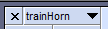
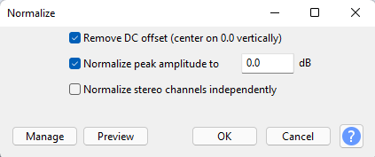
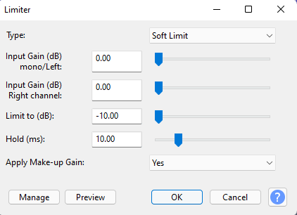
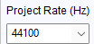

So, I just got my new UniFi G4 Doorbell installed. Out of the box, it’s great! I can view live video, past video, and spy on my dog when she’s in my front yard… All with my data being stored on my local network with no subscription fee.

While the out of box experience is great, I couldn’t help myself but look up how I can get my own ring (or "chime" as Ubiquiti calls it) uploaded to my doorbell. This requires a bit of work using some SSH, but it’s extremely fun to play around with.

&nbsp;

# The scoop

While you can do this all manually, the doorbell sadly resets back to it’s default chime when restarted. So as an example, if you loose power, your doorbell will have it’s original chime again.

This is no fun, so I made a script for you to use! You can find it on my personal GitHub page at https://github.com/TheQuib/G4-Doorbell-Custom-Chime

 - You will need to enable SSH on your doorbell before use, please refer to this section of this post to do so

**If you want to learn how to do this yourself, please continue on!**

&nbsp;

------

&nbsp;

# Enable SSH on Doorbell

This process is kinda hard to find, but enabling SSH on your UniFi Protect console (whether that be a Dream Machine, Cloud Key Gen 2+, or UniFi NVR) is pretty simple, and a quick google search away… so that won’t be covered here.

**So first off, you will need to SSH into your UniFi Protect Console**

*Dream Machine Only:*

```bash
unifi-os shell
```

&nbsp;

*Dream Mahcine + All Other Devices:*

 - Edit the file `/etc/unifi-protect/config.json`
   - If this file does not exist already, don't worry

```bash
nano /etc/unifi-protect/config.json
```

&nbsp;

Enter the following configuration to the end of the file:

```json
{
    "enableSsh": true
}
```

&nbsp;

Save the file with the following commands:
 - `Ctrl+X`
 - `y`
 - `enter`

&nbsp;

You should now be able to SSH to all of your UniFi Protect devices! The username is ubnt and the password can be set in your UniFi/Protect Console settings.

------

&nbsp;

# Prepare audio file

Now, you will need to get a working `.wav` file to be later uploaded to your doorbell. I would recommend to use a clip that is 10 seconds maximum (though I haven’t tested lengths yet).

*If you’re familiar with how to use Audacity, here are the file specifications you need:*
 - Specs:
   - Mono
   - 44100Hz
   - 16 bit
 - A good idea to:
   - Normalize the audio
   - Apply a limiter, and make sure make-up gain is applied

&nbsp;

First, get your audio file that you would like to trim down.

&nbsp;

Now, open the file in Audacity
 - The audio file will show in the main area, click the down arrow next to the file name
   - Click "Split stereo to mono"
  - Delete the second track



 - Make sure the track is selected


 - In the toolbar, click "Effect" > Normalize
   - Leave the default settings
   - Click "OK"



 - Again in the toolbar, click "Effect" > Limiter
   - Leave the default settings
   - Make sure to "Apply Make-up Gain" is set to "Yes"
   - Click "OK"



 - Make sure the "Project Rate (Hz)" at the bottom-left of Audacity is set to "44100"



 - Click "File" > "Export" > "Export as WAV"
   - Set "Encoding" to "Signed 16-bit PCM"
 - Save the file to a location you'll remember

&nbsp;

------

&nbsp;

# Upload audio file

Now we get to upload the audio file to the doorbell!

To do this, you’ll need to open a terminal of your choice (such as CMD in Windows)

Navigate to where you saved your WAV file using the cd command.

Ex:
```bash
cd C:\Users\Quib\Desktop\
```

Now, we'll use the `SCP` command to copy the file to the doorbell via SSH. General usage of SCP is:
```bash
scp localFile user@remoteHost:/path/to/remoteFile
```

Lets put our variables in there. In my case, I will be using a file name `trainHorn.wav`:
```bash
scp trainHorn.wav ubnt@192.168.10.100:trainHorn.wav
```

**NOTE: Make sure you remember this file name for later**

&nbsp;

You may notice t hat I didn't specify a path on the rmoet host, this is because we'll let the file residei n the default directory of `/etc/persistent` on the doorbell, and later create a symlink for that file to a different directory.

&nbsp;

------

&nbsp;

# Create symlink of audio file

Now, we’ll backup the original chime.wav just so it can easily be reset later if desired, and then create a symlink from our uploaded file to where chime.wav exists.

The reason this is done is because the doorbell seems to only like reading a symlink instead of a regular file when playing the chime sound.

**First, lets create the backup:

  - navigate to the `/etc/sounds/` directory and list the files to see what's in there:
```bash
cd /etc/sounds
ls
```

 - This should show a list of audio files, one of them being `chime.wav`. Lets create a backup of that:
```bash
mv chime.wav chime.wav.back
```

 - Now, lets create a symlink of our uploaded file, make sure you replace `trainHorn.wav` with the name of the file you uploaded earlier, and list the files in `/etc/sounds/`
```bash
ln -s /etc/persistent/trainHorn.wav /etc/sounds/chime.wav
ls
```

 - The `ls` command should now show two `chime` files:
   - `chime.wav`
   - `chime.wav.bak`
 - The new `chime.wav` file is the symlink you just created, and now the current doorbell chime!

&nbsp;

------

&nbsp;

# Finishing up

Now you're all done! You can go ahead and test out the new chime by pressing the ring button on your doorbell, and it should play your uploaded file.